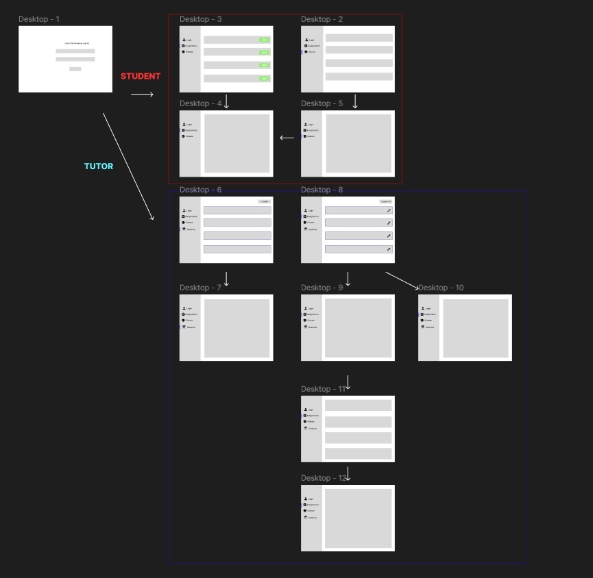

# Capstone Frontend
## Premise
* Create assignments, send assignments to students in your class, grade students' submissions from that assignment... repeat 

### Installation
1. Clone the repo 
    ```sh
    git clone https://github.com/kdang0/capstone_backend.git
    ```
2. Install NPM packages
    ```sh
    npm i
    ```
3. Change git remote url to avoid accidental pushes to base project
    ```sh
   git remote set-url origin github_username/repo_name
   git remote -v # confirm the changes
    ```
### Pages
* Assignment - Allows student to work on the given assignment and submit their answers when finished (authorization for both tutors and students)
* AssignmentList - Displays list of assignments based on user logged in (authorization for both tutors and students)
* AssignmentCreate - Allows tutors to create assignments (authorization for only tutors)
* AssignmentDisplay - Displays description, submission details, and layout of assignment (authorization for tutors and students)
* AssignmentEdit - Allows tutors to edit their assignments (authorization for only tutors)
* Class - Displays content of class such as assignments and overall grade (authorization for tutors and students)
* Login - Main page where users will need to go through in order to be authenticated 
* Student - Allows tutors to view their student roster (authorization for only tutors)
* Submission - Allows to view content for that specific submission (authorization for students and tutors)
* SubmissionList - Allows tutors to view list of submissions for each particular assignment
## Current Features
* Tutors can do full CRUD on assignments
* Authentication and Authorization
* Tutors can publish their assignments 
* Students can submit assignments given
## Future Features

* Active view on assigment with list of submissions
* Ability for tutors to grade assignments through UI 
* Ability to filter roster of students for tutors
* Ability for students to view overall grade in class
* Ability for students to view grade for particular assignment
* More customization when creating assignments 
  * Implement short answer responses
  * Ability to include visuals for questions
* Implement registration page
## TODO
* Rework on app aesthethic and layout
* Modularize requests in a separate file
* Modularize types and interfaces in a separate file
* Implement redux to reduce complexity when sharing data between components
## Acknowledgements
* https://blog.logrocket.com/authentication-react-router-v6/